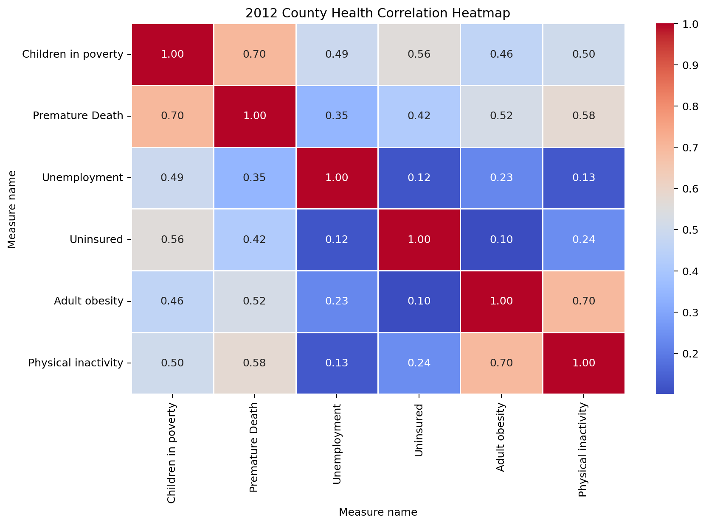

# County Health Rankings Analysis

## Overview

This project investigates factors affecting health outcomes across U.S. counties using the County Health Rankings dataset.

## Business Problem

What factors contribute most strongly to premature death across counties?

## Key Finding

Children in poverty showed a strong positive correlation (0.699) with premature death.

Counties in the highest poverty quartile experienced an average premature death rate of 10,420.88 compared with 6,173.47 in the lowest poverty quartile.

## Tools Used

- Python
- Pandas
- NumPy
- Matplotlib
- Seaborn
- Jupyter Notebook

## Visualizations

