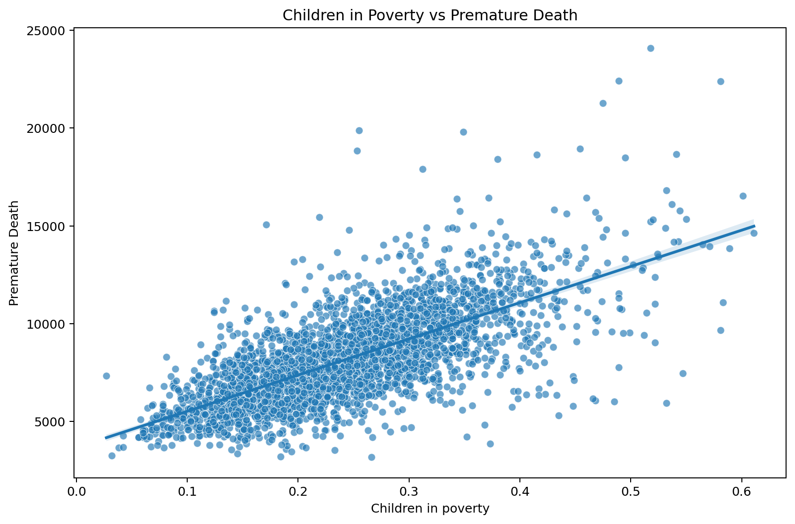
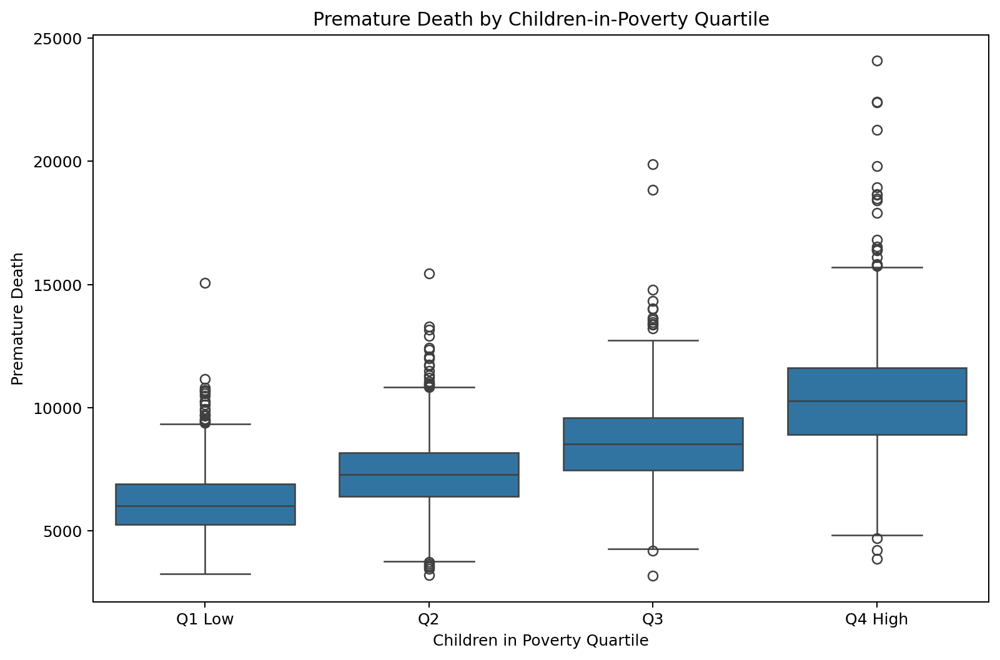

<div align="center">

# 🏥 County Health Rankings Analysis

### Exploratory Data Analysis (EDA) of County Health Rankings using Python


</div>

---

# 📖 Project Overview

This project presents a complete **Exploratory Data Analysis (EDA)** of the **County Health Rankings** dataset.

The objective was to investigate the factors that contribute to **premature death** across counties and identify which health and socioeconomic indicators have the strongest influence on health outcomes.

The project demonstrates the complete data analysis workflow, from data exploration and cleaning to visualization, interpretation, and evidence-based recommendations.

---

## 📈 Project Statistics

- 📄 Records Analyzed: **303,864**
- 📊 Variables: **14**
- 🧹 Duplicate Records Removed: **6,793**
- 📅 Analysis Year: **2012**
- 🔍 Strongest Correlation: **Children in Poverty vs Premature Death (r = 0.699)**

---

# 🔄 Analysis Workflow

1. Data Collection
2. Data Understanding
3. Data Cleaning
4. Exploratory Data Analysis (EDA)
5. Correlation Analysis
6. Data Visualization
7. Problem Identification
8. Root Cause Analysis
9. Recommendations
10. Report Generation

---

# 🎯 Business Problem

**Which county-level factors contribute most strongly to premature death, and how can these findings inform public health interventions?**

---

# 📂 Dataset

This project uses the **County Health Rankings** dataset, which contains county-level health indicators across the United States. The dataset includes measures related to health outcomes, health behaviors, clinical care, socioeconomic factors, and the physical environment.

### Key Variables

* Children in Poverty
* Adult Obesity
* Physical Inactivity
* Unemployment
* Uninsured Population
* Preventable Hospital Stays
* Violent Crime
* Premature Death
* Mammography Screening
* Diabetic Screening

The original dataset is included in the repository under the **`data/`** directory, allowing the analysis to be fully reproducible.

---

# 🛠 Technologies Used

- Python
- Pandas
- NumPy
- Matplotlib
- Seaborn
- Jupyter Notebook
- HTML
- Microsoft Word
- Git
- GitHub

---

# 📁 Project Structure

```text
County-Health-Rankings-Analysis
│
├── data
├── images
├── notebooks
├── reports
├── README.md
├── requirements.txt
└── .gitignore
```

---

# 📓 Analysis Notebook

Open the complete notebook here:

➡️ **[Open the Jupyter Notebook](notebooks/County_Health_Rankings_Analysis.ipynb)**

---

# 📊 Visualizations

## Correlation Heatmap


---

## Child Poverty vs Premature Death



---

## Premature Death by Poverty Quartile



---

# 🔍 Key Findings

- Child poverty showed the strongest positive relationship with premature death.
- Correlation coefficient between child poverty and premature death: **0.699**
- Counties in the highest poverty quartile experienced **68.8% higher premature death rates** than counties in the lowest poverty quartile.
- Physical inactivity and adult obesity also demonstrated strong positive relationships with premature death.

---

# 💡 Recommendations

- Improve healthcare accessibility.
- Increase preventive healthcare programs.
- Expand insurance coverage.
- Reduce child poverty through targeted interventions.
- Promote healthier lifestyles through community-based initiatives.

---

# 📄 Reports

- 📓 [Jupyter Notebook](notebooks/County_Health_Rankings_Analysis.ipynb)
- 📄 [Microsoft Word Report](reports/County_Health_Rankings_Presentation_Report.docx)
- 🌐 [HTML Report](reports/County_Health_Rankings_Analysis_Report.html)

---

# 👨‍💻 Author

**Princetova Toby-Diala**

If you found this project interesting, feel free to ⭐ the repository.
